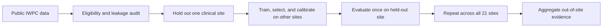
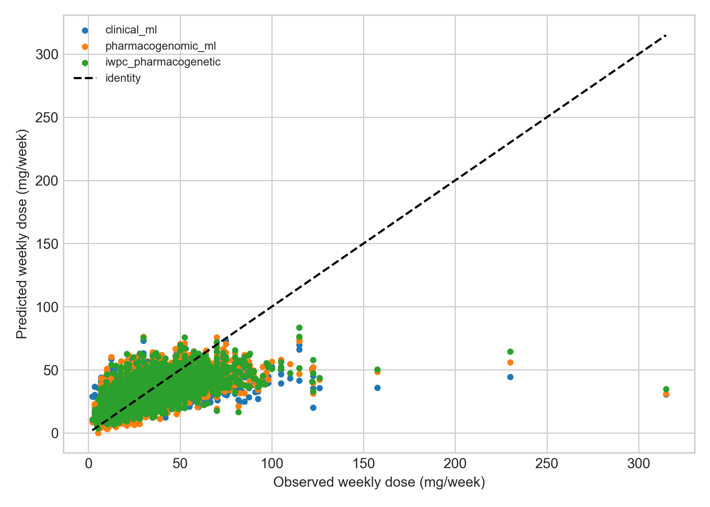
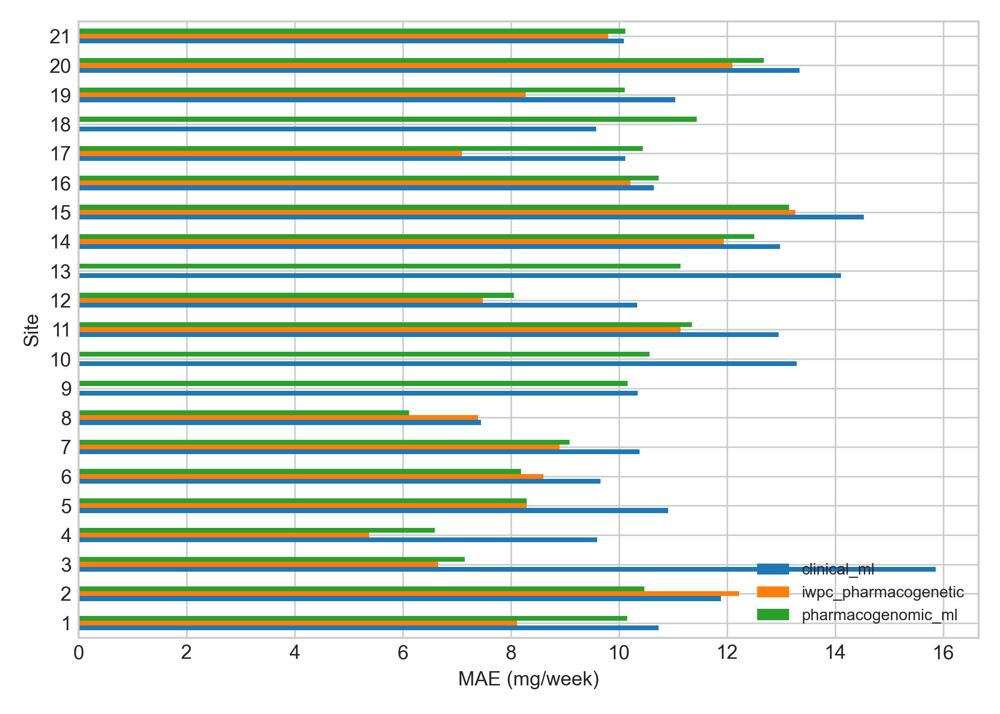

<div align="center">

# Site-Aware Warfarin Dose Prediction

**Leakage-safe clinical machine learning on public pharmacogenomic data**

[](https://github.com/CountZero-Error/Warfarin_dose-Prediction/actions/workflows/tests.yml)


Can pre-treatment clinical and pharmacogenomic data estimate stable warfarin dose for patients from a **previously unseen clinical site**?

[Results](results/README.md) · [Data card](docs/DATA_CARD.md) · [Model card](docs/MODEL_CARD.md) · [Reproduce](#reproduce-the-study)

</div>

> [!CAUTION]
> **Research use only.** This project is not prescribing guidance, a medical device, or a substitute for clinician-guided INR monitoring.

## At a glance

| Study | Design |
|---|---|
| **Public cohort** | 5,410 eligible patients from 21 sites |
| **Prediction target** | Stable therapeutic dose in mg/week |
| **Primary validation** | Leave-one-site-out evaluation |
| **Best primary ML result** | 9.48 mg/week MAE |
| **Nested ranked procedure** | 9.38 mg/week MAE |
| **Final artifact inputs** | VKORC1, CYP2C9, weight, age, height |

## Why site-aware evaluation?

Random train/test splits mix patients from the same clinical sites and produced an optimistic MAE of **8.77 mg/week**. The primary design instead holds out one entire site at a time, approximating deployment into a hospital unseen during training.



All preprocessing, model selection, feature ranking, and conformal calibration are fitted without access to the outer test site.

## Results

| Procedure | Evaluation cohort | MAE ↓ | Interpretation |
|---|---:|---:|---|
| Published IWPC pharmacogenetic equation | 4,302 | **8.65** | Smaller subset with required inputs; not directly comparable |
| Nested FeatRanker procedure | 5,410 | **9.38** | Secondary fold-wise feature-selection analysis |
| Pharmacogenomic ML | 5,410 | **9.48** | Primary all-feature model; 90.4% conformal coverage |
| Clinical-only ML | 5,410 | **11.69** | No genotype inputs |
| Fixed 35 mg/week reference | 5,410 | **13.23** | Historical population comparator, not an individual dose |

All errors are reported in **mg/week**. The displayed daily equivalent is always `weekly_dose_mg / 7`, never a separately modeled outcome.



<details>
<summary><strong>View performance across the 21 held-out sites</strong></summary>



</details>

Detailed aggregate evidence is available in the [research report](results/README.md):

- [Overall metrics](results/tables/overall_metrics.csv)
- [Paired bootstrap comparisons](results/tables/paired_differences.csv)
- [Sensitivity analyses](results/tables/sensitivity_metrics.csv)
- [Feature stability](results/tables/feature_stability.csv)

## Features and leakage controls

The final static research artifact uses five aggregate-ranked inputs:

```text
vkorc1 · cyp2c9_group · weight_kg · age_decade · height_cm
```

The nested **9.38 mg/week** result evaluates fold-specific ranked subsets: every outer training fold performs its own FeatRanker analysis. It must not be interpreted as measured performance of the separately refitted five-feature artifact.

Dose, post-treatment INR, identifiers, clinical site, and race are forbidden predictors. Race is retained only for subgroup auditing. Missing expected predictors are imputed inside each fitted pipeline.

## Reproduce the study

### 1. Install

```bash
git clone https://github.com/CountZero-Error/Warfarin_dose-Prediction.git
cd Warfarin_dose-Prediction
conda run -n DL python -m pip install -e '.[dev]'
```

Python 3.11 and 3.13 are tested in CI.

### 2. Download and verify the public data

```bash
warfarin-dose download-data --output data/raw/PS206767-553247439.xls
warfarin-dose audit-data \
  --input data/raw/PS206767-553247439.xls \
  --output artifacts/audit
```

Source: [PharmGKB IWPC submission](https://api.pharmgkb.org/v1/download/submission/553247439)

```text
SHA-256  0d95eacbcaf747638825c50a0c81ab1932a450b85e88a02990c98d26e7da5a6d
```

### 3. Run every analysis and build the report

```bash
warfarin-dose run-experiment \
  --analysis all \
  --input data/raw/PS206767-553247439.xls \
  --output artifacts/run

warfarin-dose build-report --run-dir artifacts/run
```

### 4. Verify the code

```bash
python -m pytest
ruff check src tests
python -m build
```

## Scientific safeguards

- **Site-held-out evidence:** the primary result measures transport across clinical sites.
- **Training-only selection:** model and feature selection never inspect the outer test site.
- **Uncertainty reporting:** empirical 90% conformal intervals accompany the primary models.
- **Privacy-aware publication:** curated results contain aggregate tables and calibration bins, not patient-level predictions.
- **Transparent sensitivity work:** random-CV, complete-case, ablation, and feature-selection analyses remain secondary.
- **Auditable artifacts:** source checksum, configurations, manifests, and revision provenance are recorded.

## Limitations

Performance may not transport to new healthcare systems, data-collection practices, patient populations, rare CYP2C9/VKORC1 genotypes, or high-dose ranges. Conformal coverage is empirical and is not guaranteed after distribution shift. FeatRanker permutation importance is associational, correlation-sensitive, and not causal evidence.

## Repository guide

```text
src/warfarin_dose/   analysis package and CLI
tests/               data, leakage, model, and integration checks
results/             curated aggregate evidence and figures
docs/DATA_CARD.md    cohort, source, and governance details
docs/MODEL_CARD.md   intended use, evaluation, and limitations
archive/             historical source code only
```

<details>
<summary><strong>Frozen-run provenance</strong></summary>

- Evaluation revision: `7ea3e03dc5b2bedea4e0af48421c0e6474c24283`
- Final-artifact revision: `ec753167d82242a8c176f3f2f7b1e09ad4a22dea`
- Final artifact label: `pharmacogenomic_ranked`

The final artifact was deterministically refitted without changing the frozen outer predictions.

</details>

---

<div align="center">

Built as a reproducible biomedical-informatics study using only publicly downloadable data.

</div>
